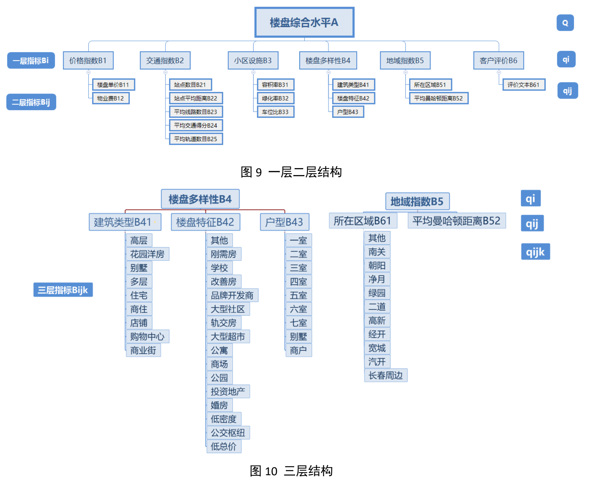

<h1 align="center">
Real estate comprehensive level evaluation algorithm based on reconstruction multi-level analysis method
</h1>
<h4 align="center">Source code for paper</h4>
<p align="center">
  <a href="https://kns.cnki.net/kcms/detail/detail.aspx?dbcode=CJFD&dbname=CJFDLAST2020&filename=CGJM202003021&v=xAPOCLDYgVPIlvQKYvbIXR3TymlHjXhZhW4k7AhlYYGSNYqRU%25mmd2BkybpI2Ks%25mmd2FEM1Vj"></a>
  <a href=""></a>
  <a href="https://github.com/svjan5/kg-reeval/blob/master/LICENSE">
    
  </a>
 </p>

## Overview

*Advantages compared with traditional methods, this 
method is combined with the characteristics of engineering, is more suitable for the quantitative data in the industry and 
standardization method, taking into consideration the emotional factors, psychological satisfaction, hierarchical structure is 
more suitable for today's real estate data structure, data sample at the same time, the verification results more convincing.* 


## Dependencies

import pandas as pd
from math import *
import matplotlib.pyplot as plt
import matplotlib as mpl
import numpy as np
from scipy.optimize import  fsolve
import math

- Compatible with Python 3.x.
- Dependencies include pandas, math, matplotlib, numpy, scipy.

## Usage:

* Real Estate information is in the all.csv, which contain 242 pieces of effective data.
* Codes is in the personalRcmd.py.
* Run `personalRcmd.py`, it will generate a file comprehensive evaluation.xlsx


## Citation:
Please cite the following paper if you use this code in your work.

```Endnote
%0 Journal Article
%A 石韵虓
%A 陈凯
%A 李沂洋
%A 崔帅
%A 成丽波
%+ 长春理工大学计算机科学技术学院;长春理工大学光电工程学院;长春理工大学理学院;
%T 基于重构的多层次分析法的楼盘综合水平评价算法
%J 长春理工大学学报(自然科学版)
%D 2020
%V 43
%N 03
%K 特征工程;量化与标准化;层次分析;心理满足度;情感分析
%X 传统的楼盘评定算法基于层次分析法,传统方法没有考虑到情感因素、无法处理结构多样的连续型,离散型,文本型数据。针对这些问题提出基于重构的多层次分析法的楼盘综合水平评定算法。根据楼盘信息重构模型层次结构,利用特征工程对楼盘连续型、离散型、文本型数据提出新的量化方法与标准化方法,过程中考虑了情感与心理满足度等主观因素。为了验证算法的适用性,使用爬虫爬取长春新房数据,通过此算法得到长春楼盘综合水平评分,该评分具有用户主观性和数据客观性,能够合理反映楼盘满足消费者需求的程度,并可计算出楼盘性价比,进行个性化购房推荐,解决了行业痛点。与传统方法相比,该方法优点在于结合了特征工程,采用的是更适用于本行业的数据量化与标准化方法,也考虑到了情感因素,心理满足度,层次结构也更加适用于如今的房地产数据结构,同时数据样例多,验证结果更具有说服力。
%P 121-129
%@ 1672-9870
%L 22-1364/TH
%W CNKI
```
```Bibtex
@article{RN107,
   author = {石韵虓 and 陈凯 and 李沂洋 and 崔帅 and 成丽波},
   title = {基于重构的多层次分析法的楼盘综合水平评价算法},
   journal = {长春理工大学学报(自然科学版)},
   volume = {43},
   number = {03},
   pages = {121-129},
   ISSN = {1672-9870},
   year = {2020},
   type = {Journal Article}
}
```

For any clarification, comments, or suggestions please create an issue or contact YunXiao Shi, email: Ancientshi@gmail.com
